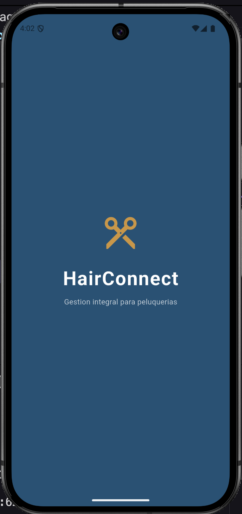
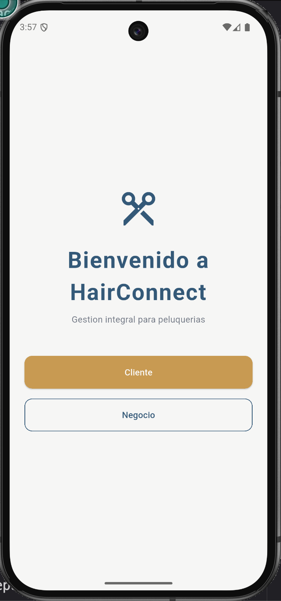
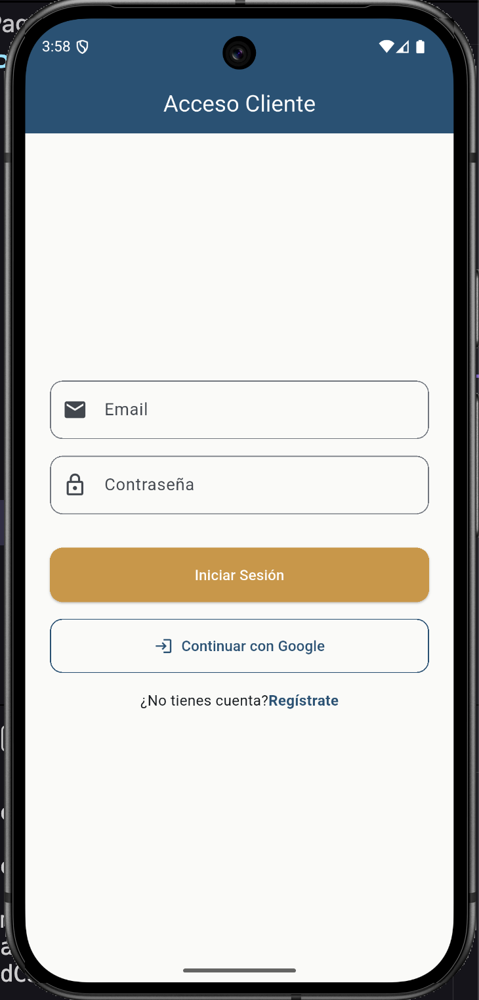
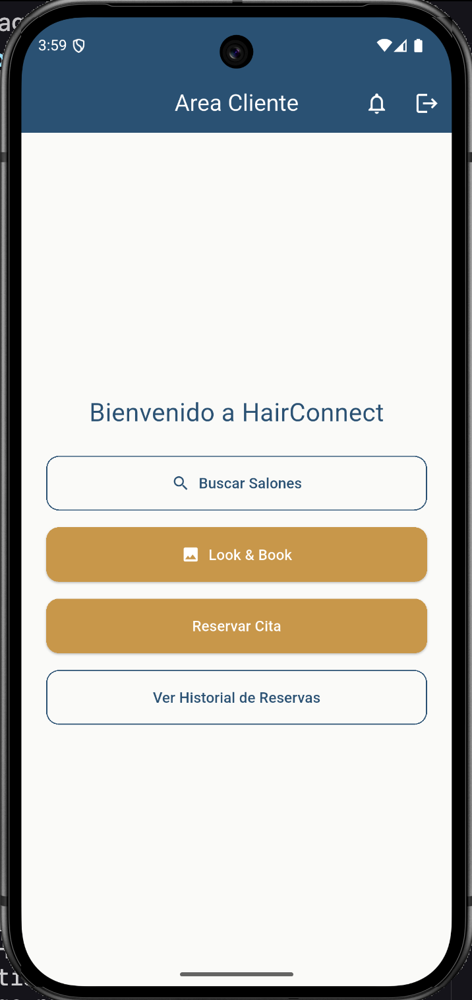
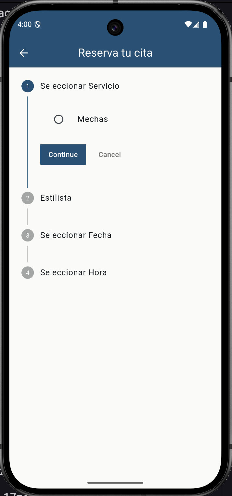

# ✂️ HairConnect

**Gestión integral de citas para peluquerías**

HairConnect es una aplicación móvil desarrollada con Flutter y Firebase que conecta clientes con salones de peluquería. Permite reservar citas, gestionar servicios y administrar el negocio desde una sola app, con dos roles de usuario diferenciados: **Cliente** y **Negocio**.

---

## 📱 Capturas de pantalla

<p align="center">
  
  
  
  
  
</p>

---

## 🚀 Funcionalidades

### Rol Cliente
- 🔐 Autenticación con email/contraseña y Google Sign-In
- 🔍 Búsqueda de salones por nombre
- 📅 Reserva de cita paso a paso (servicio → estilista → fecha → hora)
- 🖼️ Look & Book — inspiración visual para elegir estilo
- 📋 Historial de reservas

### Rol Negocio
- 📊 Dashboard de gestión
- 👥 Administración de clientes y citas
- 🔔 Sistema de notificaciones

---

## 🛠️ Tecnologías

| Tecnología | Uso |
|---|---|
| Flutter & Dart | Framework principal |
| Firebase Auth | Autenticación de usuarios |
| Cloud Firestore | Base de datos en tiempo real |
| Firebase Security Rules | Control de acceso por rol |
| BLoC / Cubit | Gestión de estado |
| GoRouter | Navegación |
| Clean Architecture | Estructura del proyecto |
| Figma | Diseño UI/UX |

---

## 🏗️ Arquitectura

El proyecto sigue **Clean Architecture** con separación en tres capas:

```
lib/
├── core/              # Utilidades y configuración global
├── features/
│   ├── auth/          # Autenticación
│   ├── cliente/       # Flujo del cliente
│   └── negocio/       # Flujo del negocio
│       ├── data/      # Repositorios y fuentes de datos
│       ├── domain/    # Entidades y casos de uso
│       └── presentation/ # UI y BLoC
```

---

## ⚙️ Instalación y ejecución

### Requisitos
- Flutter SDK >= 3.0
- Cuenta de Firebase (europe-west1)
- Android Studio o VS Code

### Pasos

```bash
# 1. Clona el repositorio
git clone https://github.com/Marce1976/HairConnect.git

# 2. Entra en el directorio
cd HairConnect

# 3. Instala las dependencias
flutter pub get

# 4. Ejecuta la app
flutter run
```

> ⚠️ Necesitas configurar tu propio archivo `google-services.json` con tu proyecto de Firebase.

---

## 👤 Autor

**Marcelo Remiro Furest**
- GitHub: [@Marce1976](https://github.com/Marce1976)
- LinkedIn: [marcelo-remiro-296240414](https://www.linkedin.com/in/marcelo-remiro-296240414/)

---

## 📚 Contexto académico

Proyecto final del Ciclo Superior de **Desarrollo de Aplicaciones Multiplataforma (DAM)** — Davante / MEDAC · 2024-2025
